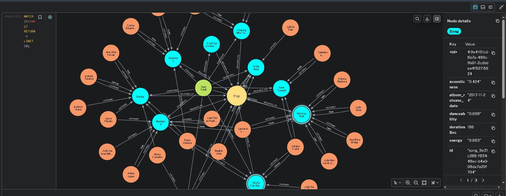

# Neo4J_Recomendacao_Musica
Criando um Algoritmo de Recomendação de Músicas Com Base Em Grafos

# 🎵 Projeto: Sistema de Recomendação Musical com Grafos Neo4j

[](https://neo4j.com/)
[](https://neo4j.com/developer/cypher/)
[](https://neo4j.com/labs/apoc/)
[](https://www.python.org/)
[](https://aistudio.google.com/)


## 📋 Sobre o Projeto

Este repositório contém a implementação de um **sistema de recomendação de músicas** baseado em **banco de dados de grafos Neo4j**. O projeto foi desenvolvido como parte de um estudo sobre modelagem de dados, algoritmos de grafos e técnicas de recomendação, aplicando conceitos de Ciência de Dados e Engenharia de Software.

O objetivo principal é demonstrar como as conexões inerentes a um grafo (usuários, músicas, artistas e gêneros) podem ser exploradas para gerar recomendações personalizadas e precisas, indo além das abordagens tradicionais baseadas em SQL.

Ao longo do projeto procuramos usar Machine Learning tanto do DeepSeek, ChatGPT, contudo só conseguimos ter sucesso no algoritmo inicial de recomendação no Gemini AI
O motivo eram os custos cobrados pelos iniciais e a descoberta que podiamos processar usando uma modelo simples na plataforma Google, logo fizemos um codigo inicial.
No futuro iremos retomar o projeto e ir melhorando, visto que temos atualmente (março/2026) que fazer a entrega do projeto.

## 👤 Autor

**Álvaro Monteiro**  
*Profissional em transição de carreira para Ciência de Dados e IA | Entusiasta de Grafos e Aprendizado de Máquina*

[]([LINK_DO_SEU_LINKEDIN])
[](https://github.com/Alvaro-MSJR)

Este projeto reflete meu objetivo de unir minha experiência em sistemas (como CRM) com minha paixão por IA e Ciência de Dados, explorando o poder dos bancos de dados de grafos para resolver problema de recomendação de musica.

## 🚀 Começando

Estas instruções permitirão que você obtenha uma cópia do projeto em operação na sua máquina local para fins de desenvolvimento e teste.


### Pré-requisitos

- **Neo4j Desktop** ou uma instância do **Neo4j Server** (versão 5.x ou superior)
- **Plugin APOC** instalado e habilitado
- **Plugin Graph Data Science (GDS)** instalado e habilitado (para algumas queries)
- **Docker** com banco Neo4j e python, para executar o script de recomendação `recomenda_musica_v1.py`
- **Python 3.x** com a biblioteca `neo4j`, `pandas`, `neo4j`, `google-generativeai`, `python-dotenv`, `google-generativeai`, `google-genai` , `python-dotenv` para executar scripts de carga de dados.

### Instalação e Configuração

1.  **Clone o repositório**
    ```bash
    git clone https://github.com/Alvaro-MSJR/[Neo4J_Recomendacao_Musica].git
    cd [Neo4J_Recomendacao_Musica]

2.  **Configurar o Banco de Dados**

- - Inicie o Neo4j e crie um novo banco de dados (ex: recomendacao-musical).

- - Abra o Neo4j Browser ou o console e execute os scripts na ordem indicada na seção Estrutura do Projeto.

- - #### [Execucação do Script de Carga do Banco](./scripts/01_create_db_V0.cypher)

- - #### [Execucação do Script de verificação da Carga do Banco (opcional)](./scripts/02_checlk_some_itens_create.cypher)

### 🧠 Modelagem de Dados (Grafo)

O modelo foi projetado para capturar a riqueza das interações musicais x usuaros.

- **Nós e Propriedades**
- - Usuario: id, nome, idade, sexo, cidade

- - Musica: id, titulo, anoLancamento, duracaoSeg, popularidade

- - Artista: id, nome, tipo ('Banda' ou 'Solista'), paisOrigem, anoInicio

- - Genero: id, nome, descricao, epocaPredominante, corHexadecimal

- **Relacionamentos e Propriedades**

- - ESCUTOU (Usuario->Musica): dataHora, dispositivo, duracaoEscutaSeg, gostou, contexto

- - CURTIU (Usuario->Musica): dataHora, dispositivo

- - SEGUE (Usuario->Artista): dataInicio, notificacoesAtivas

- - COMPOS (Artista->Musica): tipoParticipacao

- - PERTENCE_A (Musica->Genero): relevancia

###  Diagrama do Modelo

    

   
    
<!-- comentado      



--> 

### ⚙️ **Funcionalidades e Queries de Recomendação**

- Foram implementadas técnicas diferentes de recomendação, cada uma explorando uma característica distinta dos grafos.

 - - **Similaridade (Baseada em Itens usando SQL)**: Recomenda músicas dos mesmos gêneros das mais ouvidas pelo usuário.

 - - **Filtragem e Agrupamento ( usando SQL )**: Recomendações com base em dados de: músicas, gênero e pessoas

- - **Queries para execução arquivo** [12 Queries que Geram ideias de Recomendação](./queries/02_recomendacoes.cypher)

- - **Demonstração e detalhes das queries de recomendação** [Melhores detalhes e comentarios](./docs/QueriesREcomendacaoMusica2.md)

### 🤖 Procura por Inovação: Na Recomendação das Musicas para usuários

Como diferencial, o projeto inicia a exploração de uso de IA, o modelo gemini-2.5-flash-lite, para criar um modelo de recomendação de musica para um usuario e musica especifica simples. O modelo é treinado com features extraídas do grafo (como idade do usuário, popularidade da música e artista ) para prever se um usuário irá curtir uma nova música.

O script de exemplo está em [Recomendacao em Python](./scripts/python/03_recomenda_musica_v1.py)

### 📢 Atenção

- - [Requistos do ambiente para a execução](./scripts/python/requeriments.txt)

- - #### O arquivo **.env** esta dentro da pasta /scripts/python, porém deve ficar na pasta rais para execução do script python **03_recomenda_musica_v1.py**


### **Conclusão**: 
    
Não há uma técnica "melhor" universalmente. A escolha depende do contexto de negócio e dos dados disponíveis. A combinação de técnicas
pode gerar resultados superiores.

Basicamente aqui exploramos o SQL nativo do banco Neo4j e a busca de usar python para fazer o melhor de 2 mundos, banco em grafo e IA generativa

Sabemos que o projeto pode crescer, pois ainda podemos pegar o resultado das querys e jogar para um modelo para realmente criamos recomendações.


### 📈 Próximos Passos e Melhorias

**Modelo ML mais Robusto**: Utilizar os SQL resultantes juntamente com a biblioteca graphdatascience do Neo4j e o Python para criar e treinar modelos de machine learning mais inteligentes e conseguir gerar recomendações sem mais a necessidade da interação humana para analisar os resultados das querys.


# 🚀 Competências Demonstradas

✔ Modelagem de dados 

✔ Utilizacao de API Google AI Studio

✔ Criação de Querys

✔ Qualidade na Entrega de artefatos

✔ Organização de projeto no GitHub  

✔ Documentação técnica 


Aplicável para:

- Estudos de Banco Neo4j
- Estudos iniciais de IA no Google AI Studio

---

# 📁 Estrutura do Repositório

NEO4J_RECOMENDACAO_MUSICA/
- │
- ├── README.md
- ├── scripts/        - scripts criados para o projeto e serem executados.
- ├────── archive/    - dados usados
- ├────── old/        - versões antigas e outros
- ├────── python/     - codigo em python, arquivos de configuração e outros.
- ├─────────── old/   - versões antigas e outros
- ├── imagens/
- ├── queries/        - querys utilizadas no projeto
- ├─────────── old/   - versões antigas e outros
- └── docs/           - versoes de documentos e arquivos markdown


Organização alinhada a boas práticas de versionamento e documentação técnica.

---

## 👨‍💻 Desenvolvedor
<p>
    <p>&nbsp&nbsp&nbspAlvaro Monteiro<br>
    &nbsp&nbsp&nbsp
    <a href="https://github.com/Alvaro-MSJR">
    GitHub</a>&nbsp;|&nbsp;
    <a href="www.linkedin.com/in/alvaro-monteiro-silva">LinkedIn</a>
&nbsp;|&nbsp;</p>
</p>
<br/><br/>
<p>

⌨️ Outros Conteúdos por [Alvaro Monteiro](https://github.com/Alvaro-MSJR)

---

### 🤝 Contribuições
Contribuições são bem-vindas! Sinta-se à vontade para abrir uma issue ou um pull request.

### ✨ Agradecimentos
Agradeço à Dio.me e a comunidade Neo4j e a todos os entusiastas de Ciência de Dados que compartilham conhecimento e tornam projetos como este possíveis.

Muito obrigado pela atenção!